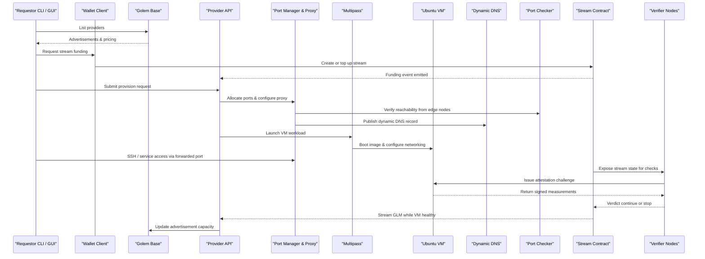
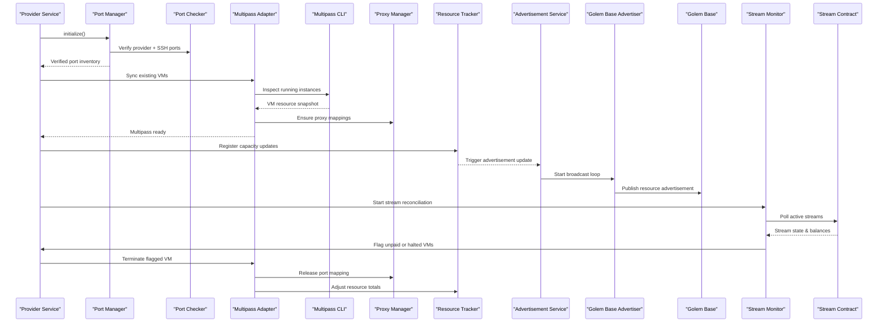
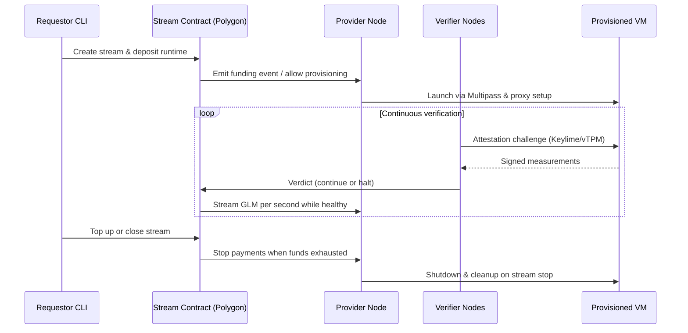
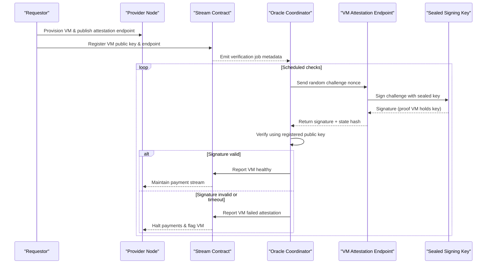
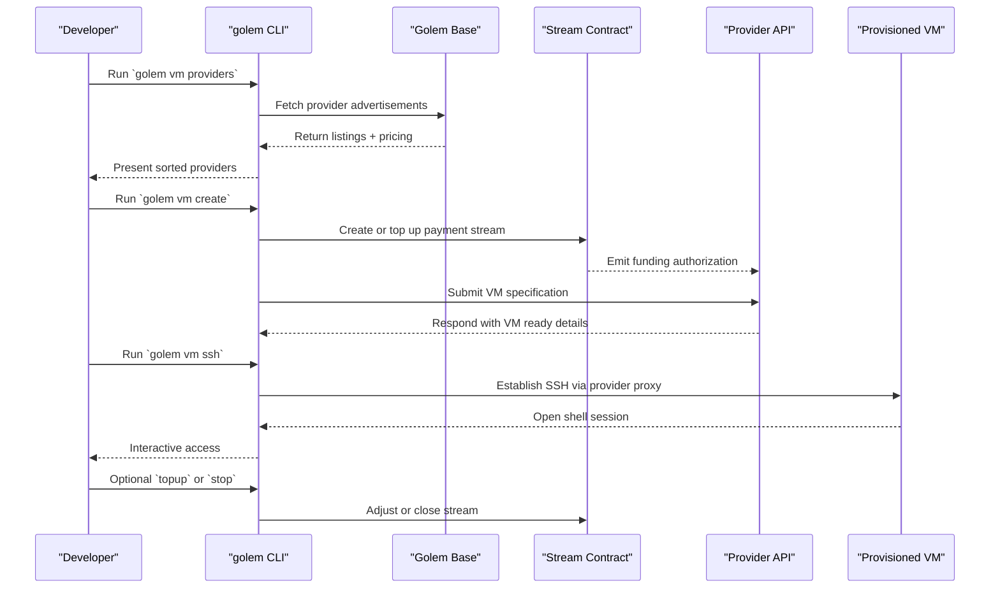

# VM on Golem
_A three-command path to plain virtual machines on the Golem Network_

**Applicant(s):**  
Phillip – Founder & Sole Developer (Discord: @phillip | GitHub: github.com/golemgrid)

**Date:**  
03/02/2025

---

## 1. Executive Summary
For eight years the Golem Network has explored decentralized cloud products, yet builders still face steep onboarding, constrained runtimes, and non-portable workloads. Over seven years inside the ecosystem I have consistently heard the same request: “Just let me rent a normal VM in a couple commands.” VM on Golem fulfills that request by exposing customizable Ubuntu virtual machines that behave exactly like the VPS instances developers use on AWS or DigitalOcean.

Requestors list providers, create a VM, and access it in up to three familiar CLI commands (`golem vm providers`, `golem vm create …`, `golem vm ssh …`). Providers price standard compute units and are paid via streaming contracts already integrated with Golem tooling. Funding from the Golem Ecosystem Fund will finalize UX polish, harden payment flows, and launch a dependable VM marketplace that finally meets community expectations.

---

## 2. Problem Statement
Over the last 7 years i've been using Golem Network, i've built probably the most advanced infrastructure around Golem Network, and i've helped and spoken with people in the community about everything. The problem with Golem Network right now is that its so hard to get started with it. You can't just come from one cloud and into Golem and expect things to work, no. You need to read tons of documentation, acquire funds from our testnet faucet (which btw often has issues and we have no monitoring on, so the #1 entrypoint for developers is often not working and hasnt for multiple years). Next to that you need to learn our SDK's, and I have yet to see one single person just state ah okay, looks simple. No, everyone has questions, the same bug that was found 4 years ago are still present and people are still hitting it. Now, once you finally figure out how to use Golem Network, you quickly find out oh, theres a limitation here, theres a limitation there, you caaaaan do this but it requires a workaround. All the time you need to invent hacky solutions because it simply doesn't work.

And finally, the thing that nobody has talked about the last 5 years: User experience. There has been absolutely 0 thought into developing some software thats simple to use for users. There's been to much faith in developers only being able to understand what a user wants.

---

## 3. Proposed Solution
Over the years i've come to conclusion that people want something simple. People expect that when they find Golem they can just run a few commands and now they have rented a virtual machine, but thats not the case. With my project codenamed VM on Golem, I believe that we've vastly overcomplicated what people want from a platform like Golem. People want a basic VM they can do stuff inside, and thats it, and thats what VM on Golem is. An exact clone 1:1 virtual machine just as if you rented a VM from another other cloud provider like AWS, DigitalOcean or Google Cloud. What this means is that people have the full freedom to build whatever they want on top. You can migrate your existing workloads from any other cloud on the internet to VM on Golem and it will just work out the box. 

How to get started with VM on Golem is incredibly simple. To rent a machine you would need to type 3 commands; `golem vm providers` to list all available providers and specs, `golem vm create --provider-id ... --cores 2 --memory 2 --disk 10` and once it has been provisioned you can type `golem vm ssh vm_name` to gain instant access to it. Thats it. The commands are self-explanatory and doesn't need any explanations. Thats what people want.

### Overview

### Key Features

### Integration with Golem Network
VM on Golem is its own custom architecture. There's nothing connected to the existing golem network (yagna). Yagna is a failed platform, and it doesn't make sense to re-use. It's vastly overengineered and suffering from tons of bugs, ux issues and much more. 

VM on Golem is its own fresh architecture.

### Differentiation

---

## 4. Requestor Web Marketplace Plan

We are building a browser-native marketplace that brings the full VM lifecycle into a MetaMask-enabled dashboard. Instead of bootstrapping with CLI tooling, requestors will open a single page, connect their wallet, and step through discovery, provisioning, and management without leaving the browser.

The experience is organized into a handful of focused surfaces:

* A **project dashboard** gives requestors an immediate view of live machines, stream health, and per-project activity.
* The **provider marketplace** lists advertisements with filters for vCPU, RAM, storage, geography, platform, and budget caps so requestors can zero in on the right host before they stake funds.
* A guided **rent wizard** walks newcomers through region selection, resource sizing, and SSH key validation before handing off to a MetaMask-powered rent dialog that opens the payment stream and provisions the VM.
* The **rentals command center** keeps track of running and terminated machines, streaming live status updates, ready-to-copy SSH commands, and safe termination controls.
* A dedicated **streams console** exposes hourly spend, remaining runway, and preset or custom length top-ups.
* The **settings workspace** stores discovery profiles, contract overrides, currency display preferences, and SSH keys so the web client stays in sync with the rest of the stack.
* A detailed **VM page** consolidates provider metadata, access information, stream state, and lifecycle actions for each instance.

Together, these surfaces translate the "three commands" promise into a point-and-click workflow: land on the dashboard, launch the wizard, approve the payment stream, receive SSH details, and monitor runtime from the same tab.

## 5. Requestor Growth Concepts

### Minecraft Server dApp

Minecraft hosting is a natural proving ground for browser-first VM rentals. The audience is mostly younger players who are already used to the idea of running their own servers for friends. Many of them have also experimented with crypto wallets or tokens, which lowers the barrier to trying a service that relies on MetaMask for payments. Because Minecraft servers are relatively inexpensive and not mission-critical, they are an ideal first use case to showcase VM on Golem.

---

#### Provisioning Flow

The dApp translates the “three commands” promise into a browser-native workflow. A requestor connects their MetaMask wallet, chooses a server profile, and confirms the payment stream.

From there, the system provisions the VM automatically: resources are allocated from a provider, the correct ports are opened, a Minecraft image is deployed, and a stable DNS record is published through Golem Base. Within minutes the requestor receives a hostname such as `play.username.golem.host` that can be shared directly with friends.

---

#### Management Experience

The management panel mirrors what players already expect from commercial Minecraft hosting services. The goal is to give users the same visual comfort they are used to, while abstracting away the underlying VM.

Key elements include:

* **Live console logs** streamed directly in the browser, showing chat messages, plugin activity, and server events.
* **File browser** with upload/download support for editing `server.properties`, uploading worlds, and managing resource packs.
* **World management** tools for backups, restores, and scheduled saves.
* **Plugin and mod handling** with drag-and-drop uploads for Forge and Fabric servers.
* **Performance metrics** such as CPU, RAM, ticks per second (TPS), and player count.

The design draws inspiration from the ultra-minimal dashboards popular in the Minecraft hosting community. Interfaces are visually lightweight, with clear buttons and no clutter—players should feel instantly at home.

*\[Insert UI screenshot here]*
*\[Insert UI screenshot here]*

---

#### Payment & Control

Streaming payments keep the experience aligned with the underlying economics of VM on Golem. The dApp displays current spend and remaining runway in real time, with a single button to top up the stream.

If a server is left idle, requestors can enable an automatic pause policy that saves the world and stops the VM when no players are online, preventing unnecessary costs. If the verifier network reports that the VM is no longer running, the stream is halted to protect the requestor from paying for downtime.

---

#### Why It Matters

This flow creates a low-friction entry point into Golem. A player can go from connecting their wallet to running a Minecraft world in a single session, without touching cloud infrastructure or command-line tools.

It taps into a community that is young, curious, and already experimenting with crypto, introducing them to Golem through an accessible and fun use case. From there, moving from a Minecraft server to a plain VM becomes trivial—the same provisioning flow, just without the Minecraft wrapper.

### Decentralized VPN dApp

A decentralized VPN is the next natural step in showcasing VM on Golem. The idea is to ship a lightweight local installer with a graphical interface that makes connecting to the network as easy as launching a game client. Payments are handled through a Web3 wallet, keeping the model consistent with other requestor flows. Under the hood, the VPN will rely on **WireGuard**, chosen for its performance, simplicity, and strong cryptography.

---

#### Provisioning Flow

The application opens with a minimal panel inspired by the same design principles as the Minecraft dApp: clean layout, two or three obvious actions, and a focus on immediacy. A requestor connects their MetaMask wallet, browses available providers, and selects the endpoint they want to connect through.

When the requestor confirms, the app provisions a VM from the chosen provider, configures WireGuard, and automatically establishes the tunnel. Within seconds the VPN is active, with no manual configuration files or command-line steps required.

---

#### Provider Discovery

The marketplace view is tailored for VPN-specific criteria. Instead of CPU or RAM, requestors see:

* **Bandwidth capacity** offered by each provider.
* **Geolocation** options for region-specific browsing.
* **Latency measurements** for selecting the fastest nodes.
* **Policy flags** such as whether the provider allows torrenting or blocks certain traffic.

These parameters allow requestors to choose endpoints that match their needs—whether it’s streaming content abroad, protecting privacy on public Wi-Fi, or running traffic through high-bandwidth nodes for downloads.

---

#### Management Experience

Once connected, the application displays a clear dashboard showing:

* Current VPN status (connected / disconnected).
* Selected provider and endpoint location.
* Real-time bandwidth usage and session runtime.
* Remaining payment runway based on the active stream.

From here, the requestor can disconnect, switch providers, or top up their stream directly. The focus is on simplicity: one page that manages the entire VPN lifecycle without technical complexity.

---

#### Payments & Control

As with other VM on Golem workloads, billing is handled through **per-second payment streaming**. The requestor sees current spend and remaining balance, and can extend their session by topping up the stream.

This approach keeps the incentives aligned: providers are rewarded fairly for uptime and throughput, while requestors only pay for the time they are actively connected. If the verifier network flags the endpoint as unhealthy, the stream halts automatically.

---

#### Why It Matters

VPNs are a proven consumer service with clear demand, but today they require centralized operators, subscription lock-ins, and opaque trust models. A decentralized VPN on Golem replaces that with open discovery, transparent provider metadata, and pay-as-you-go economics.

The installer abstracts all the complexity: connect wallet, pick a node, click connect. By reducing the flow to something as simple as a music-streaming app login, we open the door for mainstream users to engage with Golem infrastructure—this time not for gaming, but for everyday privacy and security.

---

## 6. Objectives & Impact

### Project Goals

### Provider GUI (“Battlestation”)

The Provider GUI is the operator’s control room. It presents live supply, revenue, and health at a glance, with one-click actions to manage VMs, ports, listings, and payouts. The goal is a Grafana-style dashboard—dark theme, dense but readable panels—while keeping every control self-explanatory.

---

#### Purpose

Providers need three things in one place: a truthful view of what’s running, simple controls to change it, and confidence that payments are flowing. The GUI connects directly to the local Provider Node (Multipass adapter, Port Manager, Advertiser, Stream Monitor) and pulls verified state from Golem Base so what you see on screen matches what the marketplace sees.

---

#### Home Dashboard

The landing screen is a high-signal overview that updates in real time:

* **Revenue today / this week / month** with a tiny sparkline and a “pending vs. withdrawn” split.
* **Active VMs** and **utilization gauges** (vCPU, RAM, storage) against the reserved Golem capacity.
* **Stream health** showing running streams, average runway left, halted streams, and auto-shutdowns triggered.
* **Port status** with counts for open/closed ports.
* **Alerts** for anything actionable: low balance in the provider wallet, failing attestation, or disk pressure.

Every card links to a deeper view and exposes a single safe action (e.g., “Withdraw,” “Pause listings,” “Open Port Manager”).

---

#### VM Fleet

A table and detail pane for all instances running under Multipass on this host:

* **Per-VM metrics** (CPU %, RAM %, disk IO, network throughput, load average, TPS if it’s a known service like Minecraft).
* **Lifecycle controls** (start, stop, reboot, snapshot, destroy) with confirmations and guardrails if a stream is still active.
* **SSH keys & access** showing injected keys, and the exact endpoint presented to the requestor.
* **Tags & notes** so operators can annotate long-running tenants or internal SKUs.

Behind the scenes the GUI reads from the Multipass adapter and the Resource Tracker, and writes back via the Provider API to keep state consistent.

---

#### Port & Network

A dedicated panel for everything on the wire:

* **Mapping list** of external ports → VM\:port, including protocol, status, last connection time, and byte counters.
* **Dynamic DNS** records currently advertised via Golem Base, with expiry/TTL and the last on-chain update hash.

Changes here flow through the Port Manager; the GUI blocks any operation that would strand an active stream without a confirmation.

---

#### Listings & Pricing

Everything the marketplace sees in one page:

* **Live advertisement** exactly as it appears in Golem Base: public identifier, region, CPU architecture, available cores/RAM/disk, accepted payment networks, and price in USD and GLM.
* **Price editor** that lets operators set per-unit pricing (vCPU-hour, GB-RAM-hour, GB-storage-day) and an optional minimum deposit.
* **Publish / pause** toggles with reason codes (maintenance, bandwidth cap reached, policy change).
* **Templates** for common bundles (e.g., “2 vCPU / 4GB / 40GB”) to standardize offers and speed up updates.

When you hit **Save**, the Advertiser pushes an updated ad to Golem Base; the page shows the transaction/commit reference so operators can verify propagation.

---

#### Streams & Payouts

A payments view that’s easy to reconcile:

* **Active streams** with per-second accrual, counterparty, start time, and estimated runway left based on current balance.
* **Events** such as top-ups, halts (by verifier or by requestor), and auto-shutdowns mapped to VM lifecycle events.
* **Withdrawals** for settled balances with fee estimates and a ledger of completed payouts.
* **Wallet status** including network, addresses in use, and quick actions (copy, view in explorer).

If a stream halts or runs dry, the GUI can trigger a graceful VM stop with a note stored for audit.

---

#### Health, Alerts, and Automation

Operators shouldn’t need to babysit:

* **Threshold alerts** for disk > 85%, RAM pressure, abnormal egress, or failing port checks.
* **Policy automations** such as “pause listings if external RTT > 150ms for 5 minutes” or “refuse new VMs if free disk < 20GB.”
* **Maintenance windows** to auto-pause advertisements and drain new requests, with an optional message shown in the marketplace.

Alert definitions are stored locally; summaries and key state changes are mirrored to Golem Base where relevant (e.g., listing pauses).

---

#### Audit & History

Every important action is logged:

* **Operator actions** (who paused a listing, who opened a port, who destroyed a VM).
* **System actions** (verifier halt, auto-shutdown, DNS updates).
* **External signals** (advertisement commits, stream events) with their IDs.

Logs are filterable, exportable, and include enough context to reproduce a timeline during support.

---

### Expected Outcomes

### Benefits to Golem & Ethereum

### Community Impact
The concept of VM on Golem has been shared internally within our discord, and multiple people has come out and said that they support this idea, and this is what they expect from Golem Network.

One example quote "Yes, definitely interested to use it. I dont want to read through lot of docs to rent rigs lol. I prefer something simple like few lines of copy paste or UI to rent machines."

"I'd agree on that. Well I'm in the phase of reading whatever I can find on your web page. But yes, if you plan to make it more available to regular/non-coding-ninja experts, that would work for me as well 🙂 Or even a couple of links "dear user, first learn how to write code here XYZ, then here's a video on how to rent machines". @Phillip_golem you have my vote! 🙂
"

"@Phillip_golem I think that your VM on Golem project can be a big hit!! Good luck 🤞🏿🤞🏿"

Sources: https://discord.com/channels/684703559954333727/773872812091768852/1412856551492030485
https://discord.com/channels/684703559954333727/773872812091768852/1412857516898910413
https://discord.com/channels/684703559954333727/773872812091768852/1341446378890461288

---

## VM on Golem – Architecture & Workflow

The architecture of VM on Golem is deliberately simple. Providers expose a stable API on the public internet, and requestors connect directly to rent machines. We don’t attempt NAT punching or home-router workarounds. Instead, providers must port-forward the necessary interfaces, prove their ports are reachable, and keep them open.

This sets a clear expectation: if you want to earn as a provider, you need a proper setup. On Golem, supply has always been far greater than demand, so raising the bar does not threaten the marketplace. It filters out low-reliability hosts while attracting providers who understand uptime, bandwidth, and service quality—the people we want powering VM on Golem.

### End-to-End Overview

---

## Provider Node

Providers install a dedicated node built around **Multipass**, our launch hypervisor because it runs on macOS, Linux, and Windows out of the box. The node is responsible for presenting the host to the network, advertising capacity, and delivering VM instances on demand.

When the node starts it reserves the portion of CPU, memory, and storage dedicated to Golem workloads. A local agent tracks these resources in real time and exposes a secure HTTPS API to requestors. Whenever free capacity changes—after a VM is created or destroyed—the node publishes an updated advertisement to **Golem Base (Golem DB)** so the marketplace always sees accurate numbers.

Each advertisement includes the provider’s public identifier, live resource availability, supported CPU architecture, country of operation, pricing in both USD and GLM, and the payments network the provider accepts. Because listings live on Golem Base, requestors can independently verify that the provider exists and is keeping their information fresh. Providers retain full control: they can adjust metadata, pause their listing, or change prices.

### Provider Node Components

Onboarding also includes an automated **port verification** step. The node coordinates with a port-checker service to confirm that the provider’s public IP and forwarded SSH range are reachable from multiple regions. Nodes that fail this check remain invisible until the operator fixes their routing, keeping the pool limited to operators with reliable connectivity.

Once verified, the node publishes its open port inventory alongside compute resources. Requestors can allocate these ports to expose services from their VMs, with a built-in firewall interface (CLI first, GUI later) that mirrors the simplicity of cloud dashboards like Hetzner. Requestors will be able to toggle ports on or off, apply preset rules, and audit activity while the provider software enforces those decisions at the edge.

---

## Dynamic DNS Backed by Golem Base

Raising the bar on networking introduces another reality: many community operators rely on residential or prosumer connections where the public IP can change. A traditional DNS record pointed straight at the host will eventually fail—`play.ourgame.com` suddenly resolves to the wrong place and the service goes dark.

To solve this, we plan to turn **Golem Base into a decentralized Dynamic DNS layer** that absorbs IP changes in seconds.

The domain owner still buys `ourgame.com` through their registrar. The only difference is that they delegate their authoritative name servers to Golem gateways (e.g. `ns1.golembase.net`, `ns2.golembase.net`). These gateways answer DNS queries using real-time state pulled from Golem Base instead of flat zone files.

Providers push IP updates into Golem Base whenever their address changes, with authority anchored in a **Golem Base L2 smart contract** that maps domain ownership to Ethereum keys. Only the legitimate key holder can publish updates, making hijacking impossible. When a user queries DNS, the gateway fetches the current record from Golem Base L3, wraps it in a valid DNS response, and sends it back.

The result is resilient DNS that works even for providers on dynamic IPs—without breaking the requestor’s expectation of stable, human-readable domains.

---

## Payments

Before a rental starts, requestors deposit funds into an on-chain payment stream (based on **EIP-1620 style streaming**). Providers earn continuously—paid by the second—as long as the VM runs. If the stream stops, the VM stops.

When a VM is first rented, the requestor must deposit a minimum amount of funds into the contract. This deposit defines the “runway” for how long the VM can stay alive. If more runtime is needed, the requestor can top up the stream to extend the lease.

To prevent abuse, we are designing a **verifiable execution layer** powered by verifier nodes. These nodes act as decentralized oracles: they independently check whether a VM is actually running and can halt the payment stream if the VM is proven to be down.

### Streaming Payments Flow

### How the Check Works

Each VM runs with a **virtual Trusted Platform Module (vTPM)**, provided by tools like **swtpm** when using QEMU/KVM. Inside the VM, an agent (based on **Keylime**) continuously measures the VM’s state (boot sequence, configuration, integrity) and exposes an attestation API.

* **Verifier nodes** periodically send cryptographic challenges to the VM’s Keylime agent.
* The agent signs responses with the vTPM, proving they come from the correct, untampered VM.
* The verifier nodes validate the signatures and compare the measurements against a **“golden baseline”**—a reference fingerprint of what a healthy, trusted VM should look like.

Multiple verifiers perform this check, and their results are aggregated into a **consensus verdict** (e.g. through a Chainlink Decentralized Oracle Network).

### Attestation & Oracle Flow

The oracle only accepts signatures that match the requestor-registered public key, so any deviation in the VM image or key material immediately fails attestation and halts payouts.

### Smart Contract Integration

* If the verifier network confirms the VM is running, the on-chain payment stream continues.
* If the VM fails attestation or stops responding, the consensus report triggers the contract to halt payments and optionally refund unused funds to the requestor.

This ensures providers are only paid for live, verifiable machines, and requestors never fund dead VMs. By combining continuous payment streaming with cryptographic attestation, VM on Golem becomes a self-policing, decentralized compute marketplace.

---

## Confidential Compute & Secure Storage

Opening the network to commercial workloads means assuming the host is untrusted. Technologies such as **AMD SEV** and **Intel TDX** already protect the VM’s memory while it runs, but they do not shield the disk when the VM shuts down. To close that gap we combine hardware-backed confidential compute with **full disk encryption** and **attestation-driven key release**, ensuring the VM stays protected in every state.

### The Workflow

1. The tenant builds the VM image with **LUKS full disk encryption** enabled. Without the key, the image is unreadable.
2. The image includes a minimal `initramfs` containing the tools to unlock the disk and a lightweight attestation agent (e.g. a Keylime client).
3. The provider boots the VM under SEV/TDX. The `initramfs` runs inside the hardware-encrypted enclave, while the main disk stays locked.
4. The attestation agent requests a signed measurement from the CPU and forwards it to a remote **Key Server** controlled by the workload owner.
5. The Key Server verifies the signature and measurements. If they match the golden baseline, it releases the LUKS key; otherwise it refuses.
6. The `initramfs` unlocks the volume and hands control to the OS. The key never touches disk and only exists briefly in protected memory.

### What the Host Can See

* **While running:** only encrypted memory guarded by SEV/TDX.
* **While stopped:** only an encrypted disk image (LUKS).
* **At boot:** keys are released only if attestation proves the VM is genuine.

This layered model delivers a zero-trust lifecycle: secrets remain private while the VM runs, when it pauses, and even when it is powered off.

---

## Requestor Workflow

The requestor experience stays true to the **“three commands to a VM”** promise:

1. `golem vm providers` — query Golem Base for available providers, filter by resources or location.
2. `golem vm create --provider-id <id> --cores <n> --memory <gb> --disk <gb>` — the CLI deposits funds into the stream, shares the ID with the provider, and triggers provisioning once confirmed.
3. `golem vm ssh <name>` — connect directly to the machine through the provider’s forwarded port.

Connection details are stored locally, so reconnecting or tearing down later takes just one command.

### Command Journey

---

## End-to-End Flow

* Providers install the node, port-forward, and publish their listing.
* Requestors browse listings, fund a stream, and start provisioning.
* Providers boot the VM, inject SSH keys, and expose the port.
* Golem Base keeps advertisements accurate and verifiable.
* Payment streams ensure that if funding ends, the VM shuts down gracefully.

### Dependencies & Integrations

### Feasibility & Rationale

### Risks & Mitigation

---

## 6. Roadmap & Milestones
| Phase | Deliverables | Timeline | Success Criteria |
|-------|--------------|----------|------------------|
| Phase 1 – Core Infrastructure | Requestor CLI, Provider Node, Discovery service, SSH automation | Completed (Feb 2025) | CLI provisioning works end-to-end on testnet |
| Phase 2 – Port Verification | Automated external port checks, diagnostics, readiness gating | Completed (Feb 2025) | Providers validated before listing; reduced connection failures |
| Phase 3 – Smart Contract Payments | StreamPayment integration, CLI stream tooling, automated withdrawals | Feb–Mar 2025 | Stable per-second billing on Holesky L2 with <2% settlement errors |
| Phase 4 – Provider GUI | Resource dashboard, revenue tracking, analytics | Mar–Apr 2025 | 50+ providers using GUI weekly; telemetry shows active engagement |
| Phase 5 – Verifier Network | Decentralized integrity proofs, uptime monitoring, reputation scoring | Apr–May 2025 | Verifier reports reduce false-positive provider listings |
| Phase 6 – Requestor Web Interface | Browser-based VM marketplace with wallet auth and cost tracking | Apr–May 2025 | Web users launch VMs with parity to CLI; conversion metrics established |
| Phase 7 – Decentralized Discovery | On-chain provider registry, open filtering APIs | May–Jun 2025 | Providers self-advertise on-chain; requestors resolve via trust-minimized index |

---

## 7. Budget

### Total Funding Requested

### Breakdown by Phase / Milestone

### Resource Allocation

### Payment Schedule Suggestion

---

## 8. Team

### Member Profiles

### Relevant Track Record

---

## 9. Open Source Commitment

### Licensing

### Components to be Open-Sourced

### Documentation Plans

---

## 10. Community Engagement

### Engagement Strategy

### Communication Channels

### Community Programs

---

## 11. Sustainability Plan

### Maintenance & Ownership

### Long-Term Vision

### Future Funding or Revenue Model

---

## 12. Evaluation & Metrics

### Key Performance Indicators

### Reporting Cadence & Format

---

## 13. Appendices (Optional)

### Technical Diagrams

### Visual Assets

### Extended Background & Support Letters
