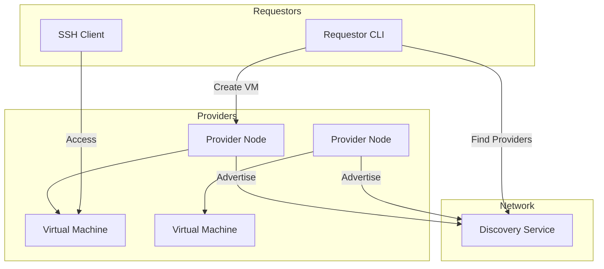
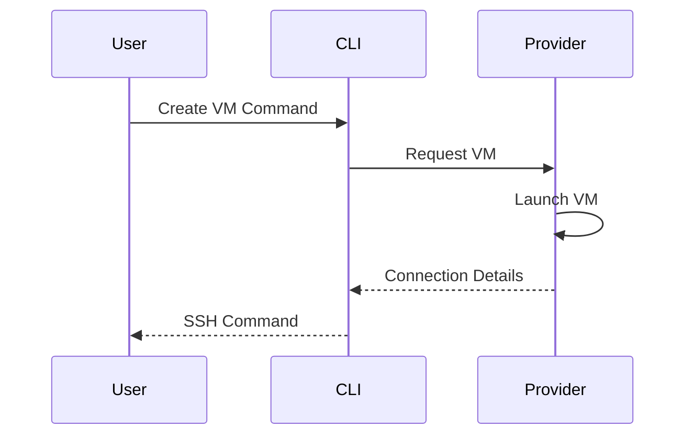

# VM on Golem

Rent computing power as easily as ordering a pizza. VM on Golem makes it simple to either rent out your spare computing resources or get the computing power you need, when you need it.

https://github.com/user-attachments/assets/4ab118f6-fa00-4612-8033-dea7b352deae

## What is VM on Golem?

Think of VM on Golem as the Airbnb for computing power:
- **Providers** are like hosts, offering their spare computing power
- **Requestors** are like guests, renting computing power when they need it

It's that simple. No complex protocols, no specialized knowledge needed - just straightforward virtual machines that work exactly like any cloud provider you're used to.

> Sometimes the simplest solution is the best solution. This MVP was built in 24 hours using standard tools and protocols - because renting computing power shouldn't be rocket science.

## System Overview



## How Simple? This Simple:

If you need computing power:
```bash
# Find available providers
golem vm providers

# See what's available
────────────────────────────────────────────────
  🌍 Available Providers (3 total)
────────────────────────────────────────────────
Provider ID     Country   CPU    Memory    Storage
provider-1      🌍 SE     💻 4    🧠 8GB    💾 40GB
provider-2      🌍 US     💻 8    🧠 16GB   💾 80GB
provider-3      🌍 DE     💻 2    🧠 4GB    💾 20GB
────────────────────────────────────────────────

# Create a VM
golem vm create my-webserver --provider-id provider-1 --cpu 2 --memory 4 --storage 20

# Connect via SSH, just like any other VM
golem vm ssh my-webserver
```

If you want to offer computing power:
1. Install the provider software
2. Choose how much CPU, memory, and storage to offer
3. Start earning by sharing your resources

## Why VM on Golem?

Traditional cloud platforms are complex and centralized. VM on Golem brings:
- **Simplicity**: One command to get a VM
- **Familiarity**: Works just like any VM you're used to
- **Freedom**: Run anything you want, it's your VM
- **Decentralization**: Connect directly with providers worldwide

No SDKs to learn. No custom protocols. No complex configuration. Just VMs that work.

## Components

### 1. Requestor CLI

A simple command-line tool for finding providers and managing VMs:
- List available providers with their resources
- Create and manage VMs with simple commands
- Secure SSH access management
- Local state tracking



### 2. Provider Node

Turn your machine into a provider on the Golem Network:
- Automated VM management with Multipass
- Resource monitoring and allocation
- Secure SSH proxy system
- Automatic cleanup and maintenance

### 3. Discovery Service

The central hub connecting providers and requestors:
- Real-time provider advertisements
- Resource matching and filtering
- Health monitoring
- Security and rate limiting

## Getting Started

### As a Requestor

1. Install the CLI:
```bash
pip install golem-vm-requestor
```

2. Find a provider:
```bash
golem vm providers
```

3. Create your VM:
```bash
golem vm create my-webserver --cpu 2 --memory 4 --storage 20
```

### As a Provider

1. Install the provider software:
```bash
pip install golem-vm-provider
```

2. Configure your resources:
```bash
# Edit .env file with your settings
GOLEM_PROVIDER_MAX_VMS=10
GOLEM_PROVIDER_MIN_CPU_CORES=1
GOLEM_PROVIDER_MIN_MEMORY_GB=1
```

3. Start the provider:
```bash
golem-provider start
```

## Technical Details

The system consists of three main components, each built with simplicity in mind:

1. **Requestor CLI** (`requestor-server/`)
   - Command-line interface
   - Provider discovery
   - VM management
   - SSH key handling

2. **Provider Node** (`provider-server/`)
   - VM lifecycle management using standard tools
   - Resource monitoring
   - SSH proxy system
   - Advertisement management

3. **Discovery Service** (`discovery-server/`)
   - Provider registration
   - Resource matching
   - Health checking
   - Security measures

## Development

Each component has its own README with detailed development instructions:
- [Requestor CLI Documentation](requestor-server/README.md)
- [Provider Node Documentation](provider-server/README.md)
- [Discovery Service Documentation](discovery-server/README.md)

Built with standard tools and protocols:
- FastAPI for APIs
- SQLite for storage
- Multipass for VM management
- Standard SSH for access

## Contributing

1. Fork the repository
2. Create a feature branch
3. Make your changes
4. Run the tests
5. Submit a pull request

Remember: Keep it simple. If you can't explain your change to a 12-year-old, it's probably too complex.

## License

This project is part of the Golem Network and is licensed under the GPL-3.0 license.
