# VM on Golem

Rent computing power as easily as ordering a pizza. VM on Golem makes it simple to either rent out your spare computing resources or get the computing power you need, when you need it.

> **8 years of development vs 24 hours of simplicity**: Sometimes the simplest solution is the best solution. This MVP was built in a single day using standard tools and protocols - because renting computing power shouldn't be rocket science. No custom protocols, no specialized knowledge, no complex SDKs. Just VMs that work.

https://github.com/user-attachments/assets/4ab118f6-fa00-4612-8033-dea7b352deae

## What is VM on Golem?

Think of VM on Golem as the Airbnb for computing power:

-   **Providers** are like hosts, offering their spare computing power
-   **Requestors** are like guests, renting computing power when they need it

It's that simple. No complex protocols, no specialized knowledge needed - just straightforward virtual machines that work exactly like any cloud provider you're used to.

## Roadmap

### ✅ Core Infrastructure (Completed in 24 hours)

-   [x] Requestor CLI with simple commands
-   [x] Provider Node with VM management
-   [x] Discovery Service for provider matching
-   [x] SSH key management and proxy system
-   [x] Resource monitoring and allocation
-   [x] Basic provider advertisement system

### ✅ Network Enhancement (Completed)

-   [x] Port Verification System
    -   Validates VM access port accessibility ({start_port}-{end_port})
    -   Ensures provider port ({provider_port}) availability
    -   Real-time verification status display
    -   Proactive network diagnostics
    -   Temporary port check servers (to be replaced by verifier nodes)

### 💰 Payment System

-   [ ] Smart Contract Integration
    -   Automated payments for VM usage
    -   Secure fund management
    -   Payment verification
    -   Usage tracking

### 🔒 Verifier Network

-   [ ] Decentralized VM Verification
    -   Network of verifier nodes
    -   Real-time VM status monitoring
    -   Fraud prevention system
    -   Smart contract status updates
    -   Consensus-based verification

### 🌐 Decentralized Discovery

-   [ ] Blockchain Job Board
    -   Provider listings on-chain
    -   Decentralized resource matching
    -   Transparent pricing
    -   Provider reputation system

```mermaid
graph LR
    subgraph "Phase 1 ✅"
        A[Core Infrastructure]
    end

    subgraph "Phase 2 ✅"
        B[Port Verification]
    end

    subgraph "Phase 3 💰"
        C[Payment System]
    end

    subgraph "Phase 4 🔒"
        D[Verifier Network]
    end

    subgraph "Phase 5 🌐"
        E[Decentralized Discovery]
    end

    A --> B --> C --> D --> E
```



## System Overview


## How Simple? This Simple:

If you need computing power:

```bash
# Find available providers
golem vm providers

# See what's available
────────────────────────────────────────────────
  🌍 Available Providers (3 total)
────────────────────────────────────────────────
Provider ID     Country   CPU    Memory    Storage
provider-1      🌍 SE     💻 4    🧠 8GB    💾 40GB
provider-2      🌍 US     💻 8    🧠 16GB   💾 80GB
provider-3      🌍 DE     💻 2    🧠 4GB    💾 20GB
────────────────────────────────────────────────

# Create a VM
golem vm create my-webserver --provider-id provider-1 --cpu 2 --memory 4 --storage 20

# Connect via SSH, just like any other VM
golem vm ssh my-webserver
```

If you want to offer computing power:

1. Install the provider software
2. Choose how much CPU, memory, and storage to offer
3. Start earning by sharing your resources

## Why VM on Golem?

Traditional cloud platforms are complex and centralized. VM on Golem brings:

-   **Simplicity**: One command to get a VM
-   **Familiarity**: Works just like any VM you're used to
-   **Freedom**: Run anything you want, it's your VM
-   **Decentralization**: Connect directly with providers worldwide

Built in 24 hours with:

-   Standard SSH for access (not a custom protocol in sight)
-   Multipass for VM management (because why reinvent the wheel?)
-   FastAPI for simple APIs (no complex frameworks needed)
-   SQLite for storage (sometimes a file is all you need)

## Components

### 1. Requestor CLI

A simple command-line tool for finding providers and managing VMs:

-   List available providers with their resources
-   Create and manage VMs with simple commands
-   Secure SSH access management
-   Local state tracking


### 2. Provider Node

Turn your machine into a provider on the Golem Network:

-   Automated VM management with Multipass
-   Resource monitoring and allocation
-   Secure SSH proxy system
-   Comprehensive port verification
-   Automatic cleanup and maintenance

### 3. Discovery Service

The central hub connecting providers and requestors:

-   Real-time provider advertisements
-   Resource matching and filtering
-   Health monitoring
-   Security and rate limiting

## Getting Started

### Choose Your Role

VM on Golem offers different components based on your needs:

### 1. For Users Wanting to Rent VMs (Requestors)

```bash
# Install the requestor CLI
pip install request-vm-on-golem

# List available providers
golem vm providers

# Create a VM
golem vm create my-webserver --cpu 2 --memory 4 --storage 20

# SSH into your VM
golem vm ssh my-webserver

# List your VMs
golem vm list

# Stop a VM
golem vm stop my-webserver

# Remove a VM
golem vm destroy my-webserver
```

### 2. For Users Offering Computing Power (Providers)

```bash
# Install the provider software
pip install golem-vm-provider

# Configure your resources in .env
GOLEM_PROVIDER_MAX_VMS=10
GOLEM_PROVIDER_MIN_CPU_CORES=1
GOLEM_PROVIDER_MIN_MEMORY_GB=1
GOLEM_PROVIDER_MIN_STORAGE_GB=10

# Start earning by sharing your resources
golem-provider start
```

### 3. For Running a Discovery Server

```bash
# Install the discovery service
pip install golem-vm-discovery

# Configure in .env
DISCOVERY_HOST="0.0.0.0"
DISCOVERY_PORT=9001
DISCOVERY_DB_URL="sqlite:///discovery.db"

# Start the discovery service
golem-discovery start
```

### 4. For Running a Port Checker Server

```bash
# Install the port checker
pip install golem-port-checker

# Configure in .env
PORT_CHECKER_HOST="0.0.0.0"
PORT_CHECKER_PORT=9000

# Start the port checker service
port-checker start
```

Each component is independently installable and configurable. Install only what you need based on your role in the network.

For detailed configuration and usage instructions, see each component's documentation:

-   [Requestor CLI Documentation](requestor-server/README.md)
-   [Provider Node Documentation](provider-server/README.md)
-   [Discovery Service Documentation](discovery-server/README.md)
-   [Port Checker Documentation](port-checker-server/README.md)

## Technical Details

The system consists of three main components, each built with simplicity in mind:

### Port Verification

The system includes a robust port verification system:

1. **Provider Startup**

    - Verifies provider port ({provider_port}) accessibility
    - Checks VM access port range ({start_port}-{end_port})
    - Real-time verification status display
    - Actionable troubleshooting guidance

2. **Current Implementation**

    - Uses dedicated port check servers
    - Verifies both local and external accessibility
    - Provides visual progress indicators
    - Automatic port allocation management

3. **Future Enhancement**
    - Port verification will be integrated into verifier nodes
    - Decentralized verification through the network
    - Consensus-based accessibility confirmation

### Core Components

1. **Requestor CLI** (`requestor-server/`)

    - Command-line interface
    - Provider discovery
    - VM management
    - SSH key handling

2. **Provider Node** (`provider-server/`)

    - VM lifecycle management using standard tools
    - Resource monitoring
    - SSH proxy system
    - Advertisement management

3. **Discovery Service** (`discovery-server/`)
    - Provider registration
    - Resource matching
    - Health checking
    - Security measures

## Development

Each component has its own README with detailed development instructions:

-   [Requestor CLI Documentation](requestor-server/README.md)
-   [Provider Node Documentation](provider-server/README.md)
-   [Discovery Service Documentation](discovery-server/README.md)

## Contributing

1. Fork the repository
2. Create a feature branch
3. Make your changes
4. Run the tests
5. Submit a pull request

Remember: Keep it simple. If you can't explain your change to a 12-year-old, it's probably too complex.

## Publishing

For instructions on publishing new versions of the packages to PyPI, see [PUBLISHING.md](PUBLISHING.md).

>
