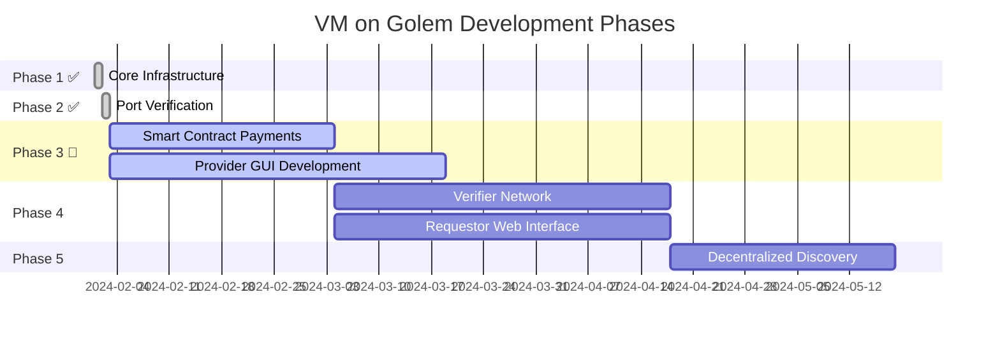
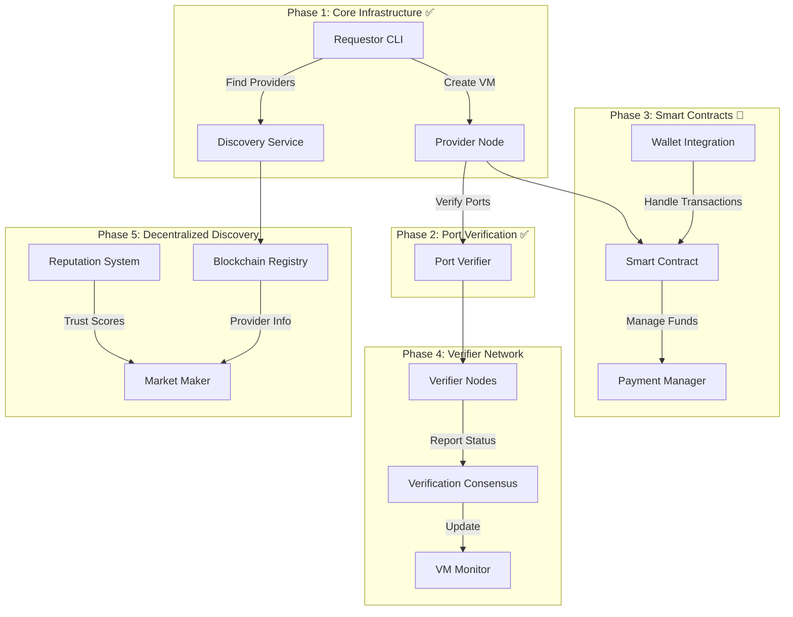

# VM on Golem - Project Roadmap

## 1. Project Timeline Overview

## 2. Technical Architecture Evolution

## 3. Detailed Phase Breakdown

### Phase 1: Core Infrastructure (✅ Completed)
- **Achievement**: Built in 24 hours
- **Components**:
  - Requestor CLI with intuitive commands
  - Provider Node with VM management
  - Discovery Service for matchmaking
  - SSH key management system
  - Resource monitoring
  - Basic provider advertisement

### Phase 2: Port Verification (✅ Completed)
- **Achievement**: Completed in 24 hours
- **Features**:
  - Automated port accessibility validation
  - Real-time verification status
  - Network diagnostics
  - Temporary port check servers
  - Provider readiness confirmation

### Phase 3: Smart Contract Payments (🚧 In Progress)
- **Objective**: Create a trustless payment system
- **Key Components**:
  - Smart contract for fund management
  - Deposit and withdrawal system
  - Usage-based billing
  - Payment verification
  - Automated fund distribution
- **Technical Focus**:
  - Implement time-based billing
  - Secure fund management
  - Transaction optimization
  - Gas cost efficiency

### Phase 3: Provider GUI Development (🚧 In Progress)
- **Objective**: Create an intuitive datacenter management interface
- **Key Components**:
  - Resource Dashboard
    - Total CPU cores (used vs. available)
    - Memory allocation (used vs. available)
    - Storage utilization
    - Network bandwidth usage
  - Market Analytics
    - Your pricing vs. market average
    - Demand trends in your region
    - Competitive analysis
  - Revenue Tracking
    - Current monthly earnings
    - Historical earnings graph
    - Projected revenue based on current usage
  - Active VMs
    - Status indicators for each VM
    - Resource allocation per VM
    - Uptime statistics
    - Current revenue per VM

### Phase 4: Verifier Network (🔒 Planned)
- **Objective**: Ensure VM integrity and uptime
- **Components**:
  - Decentralized verifier nodes
  - Cryptographic proof system
  - Consensus mechanism
  - Smart contract integration
  - Port verification service
- **Technical Implementation**:
  - VM fingerprinting system
  - Cryptographic signature verification
  - Consensus protocol
  - Automated status updates
  - Provider reputation tracking

### Phase 4: Requestor Web Interface (🚧 Planned)
- **Objective**: Develop a sleek, intuitive website for VM rental and management
- **Core Features**:
  - **Authentication**
    - MetaMask integration
    - Wallet connection status
    - Account overview
    - Transaction history
  - **VM Management Dashboard**
    - Quick-launch VM templates
    - Active VMs status grid
    - Resource usage metrics
    - Cost tracking per VM
  - **Provider Marketplace**
    - Available providers list
    - Provider ratings and metrics
    - Price comparisons
    - Resource availability
    - Quick-rent functionality
  - **VM Control Center**
    - SSH access management
    - Start/Stop/Restart controls
    - Resource scaling options
    - Performance monitoring
    - Cost projections

### Phase 5: Decentralized Discovery (🌐 Future)
- **Objective**: Fully decentralized marketplace
- **Features**:
  - On-chain provider registry
  - Reputation system
  - Automated matchmaking
  - Price discovery mechanism
  - Provider metrics
