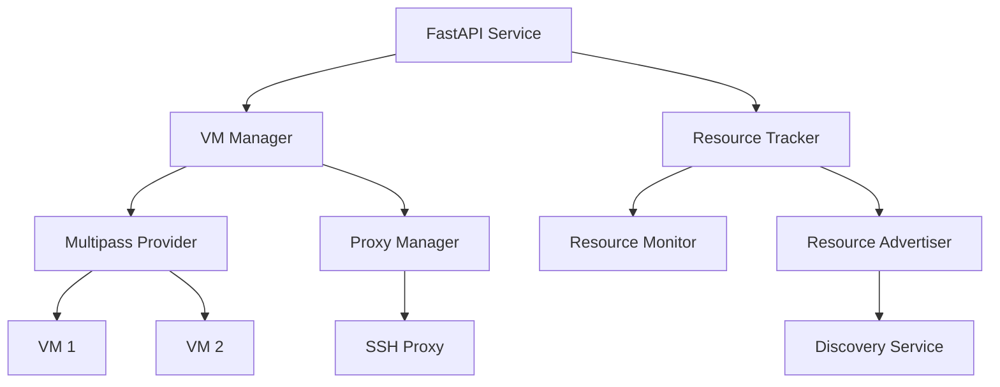
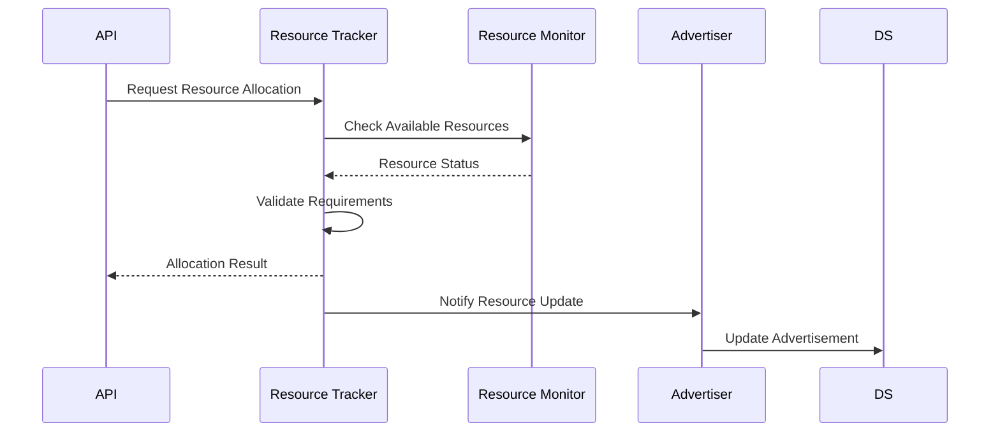
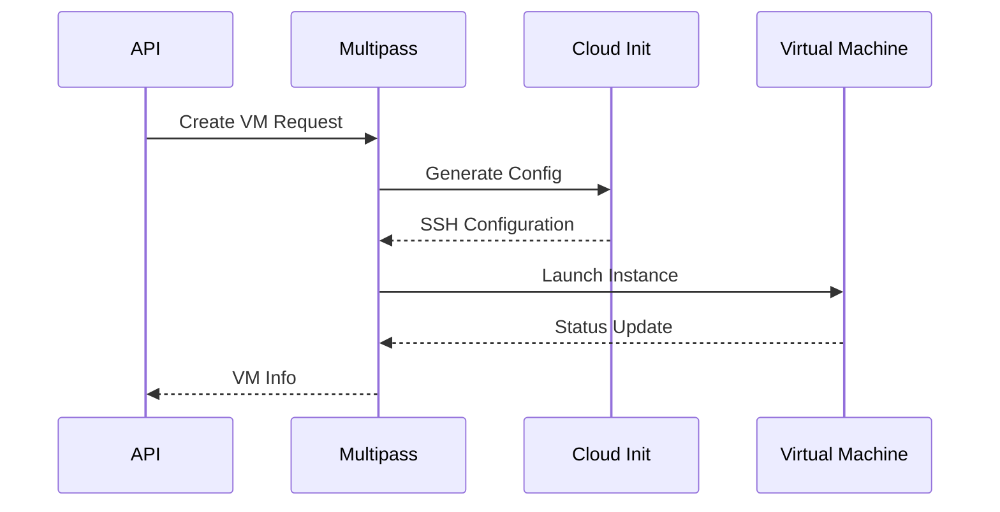
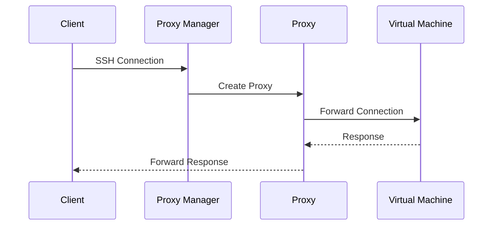
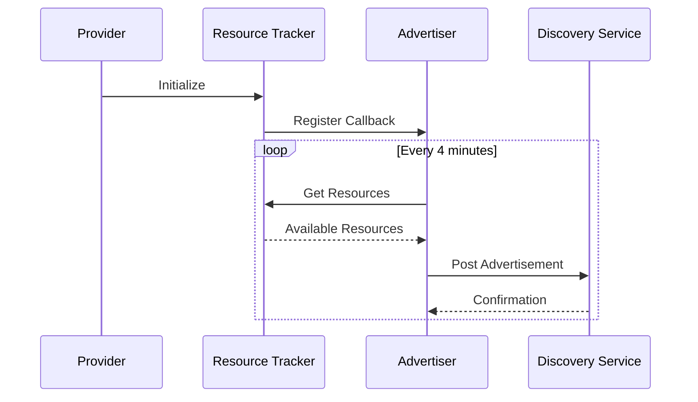

# VM on Golem Provider Node

The Provider Node enables participation in the Golem Network by managing virtual machines and computing resources. It handles VM lifecycle management, resource allocation, network proxying, and automated discovery advertisement.

## System Architecture



The Provider Node implements a clean, modular architecture where each component handles a specific responsibility:

## Core Components

### Resource Management

The resource management system ensures optimal allocation and utilization of system resources:

- Real-time monitoring of CPU, memory, and storage
- Intelligent resource allocation with minimum requirement enforcement
- Threshold-based resource protection
- Automatic resource reclamation



### VM Management

VM operations are handled through Multipass integration:



- Automated VM provisioning with cloud-init
- Secure SSH key management
- Status monitoring and health checks
- Automatic cleanup procedures

### Network Proxy System

A pure Python implementation manages SSH connections:



- Dynamic port allocation and management
- Connection state persistence
- Clean connection handling
- Automatic proxy cleanup

## Installation

1. Prerequisites:
   - Python 3.9+
   - Multipass
   - Poetry

2. Install dependencies:
   ```bash
   cd provider-server
   poetry install
   ```

3. Configure environment:
   ```bash
   cp .env.example .env
   # Edit .env with your settings
   ```

## Configuration

Key configuration options in `.env`:

```bash
# Provider Settings
GOLEM_PROVIDER_ID="your-provider-id"
GOLEM_PROVIDER_NAME="your-provider-name"
GOLEM_PROVIDER_COUNTRY="SE"

# Resource Limits
GOLEM_PROVIDER_MAX_VMS=10
GOLEM_PROVIDER_MIN_CPU_CORES=1
GOLEM_PROVIDER_MIN_MEMORY_GB=1
GOLEM_PROVIDER_MIN_STORAGE_GB=10

# Network Settings
GOLEM_PROVIDER_PORT_RANGE_START=50800
GOLEM_PROVIDER_PORT_RANGE_END=50900
GOLEM_PROVIDER_PUBLIC_IP="auto"

# Discovery Settings
GOLEM_PROVIDER_DISCOVERY_URL="http://discovery.golem.network:7465"
GOLEM_PROVIDER_ADVERTISEMENT_INTERVAL=240
```

## API Reference

### Create VM

```bash
POST /api/v1/vms
```

Request:
```json
{
    "name": "my-webserver",
    "cpu_cores": 2,
    "memory_gb": 4,
    "storage_gb": 20
}
```

Response:
```json
{
    "id": "golem-my-webserver-20250219-130424",
    "name": "my-webserver",
    "status": "running",
    "ip_address": "192.168.64.2",
    "ssh_port": 50800,
    "resources": {
        "cpu": 2,
        "memory": 4,
        "storage": 20
    }
}
```

### VM Operations

- List VMs: `GET /api/v1/vms`
- Get VM Status: `GET /api/v1/vms/{vm_id}`
- Delete VM: `DELETE /api/v1/vms/{vm_id}`
- Get Access Info: `GET /api/v1/vms/{vm_id}/access`

## Operations

### Starting the Provider

```bash
poetry run python run.py
```

The provider will:
1. Initialize resource monitoring
2. Start the proxy manager
3. Begin resource advertisement
4. Listen for VM requests

### Resource Advertisement Flow



### Monitoring

The provider includes comprehensive logging:
- Resource allocation events
- VM lifecycle changes
- Network proxy operations
- Discovery service interactions

## Technical Details

### Security

- Resource isolation through Multipass
- Secure SSH key provisioning
- Connection proxying for network isolation
- Rate limiting on API endpoints

### Performance

- Asynchronous operations with FastAPI
- Efficient resource tracking
- Connection pooling for proxy servers
- Optimized VM provisioning

### Resource Protection

- CPU threshold: 90%
- Memory threshold: 85%
- Storage threshold: 90%
- Minimum resource guarantees

## Troubleshooting

Common issues and solutions:

1. Port Allocation Failures
   - Check port range availability
   - Verify no conflicts with other services

2. Resource Allocation Failures
   - Check system resource availability
   - Verify minimum requirements

3. Discovery Service Issues
   - Check network connectivity
   - Verify discovery service URL
   - Check advertisement interval

## Contributing

1. Fork the repository
2. Create a feature branch
3. Make your changes
4. Run the tests
5. Submit a pull request


